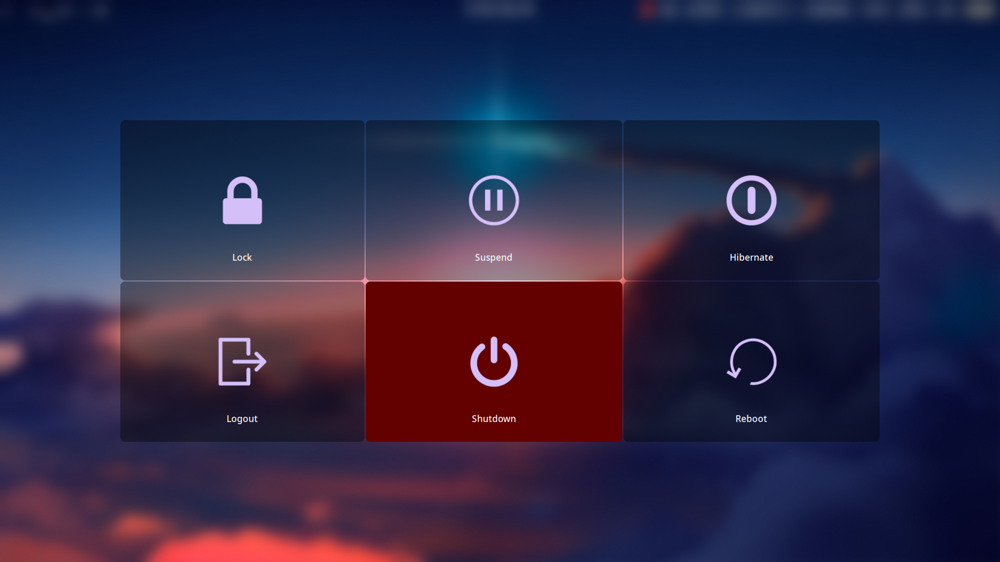
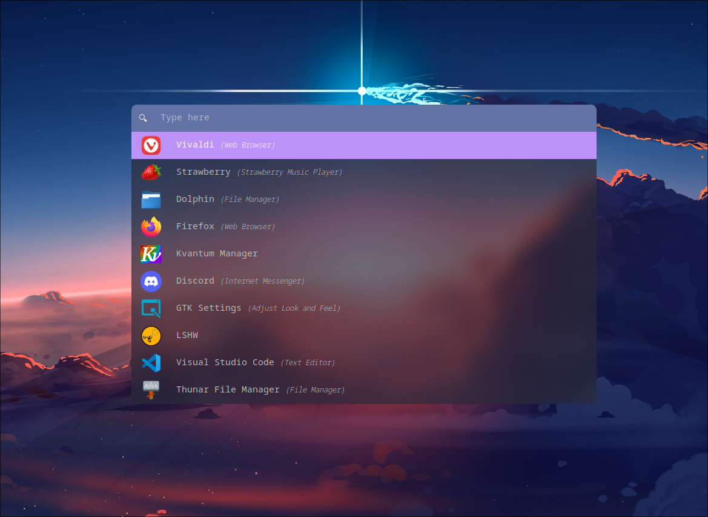

dotfiles and scripts for my arch linux setup
  
home

  

waybar

  
logout screen (wlogout)

  

menu (rofi)

scripts:

setWall: set background wallpaper. takes path to a picture as the argument.  
rec: starts screen recording.  
killmenow: shutdown.  
chargeThresh: prints current max charging limit.  
setMaxCharge: sets maximum charging limit.  
blueDisconnect: disconnects bluetooth.  
getJuice: sets maximum cpu frequency limit to 4.5GHz.  
base: sets maximum cpu frequency limit to 2GHz.  
getOrs: sets maximum cpu frequency limit to 4GHz.  
uploadConfig: for uploading dotfiles to github.
